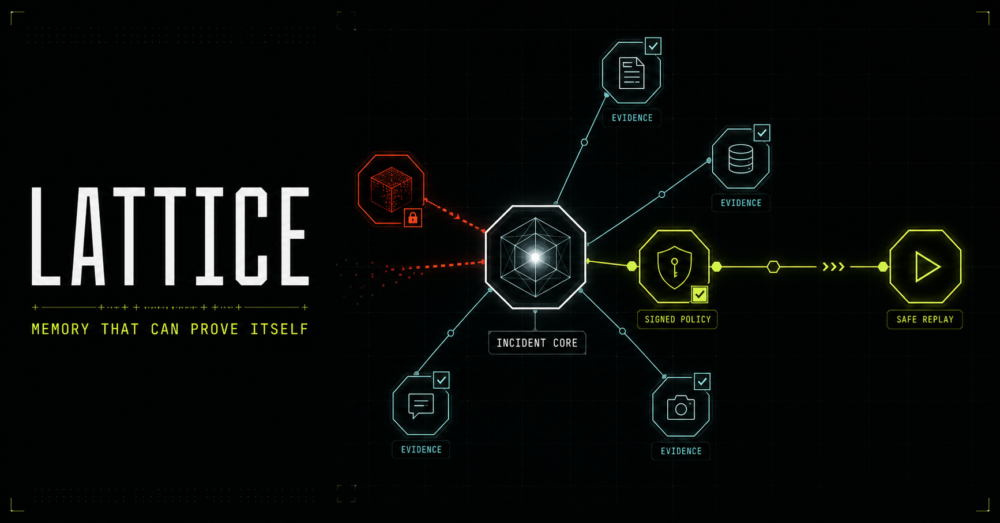
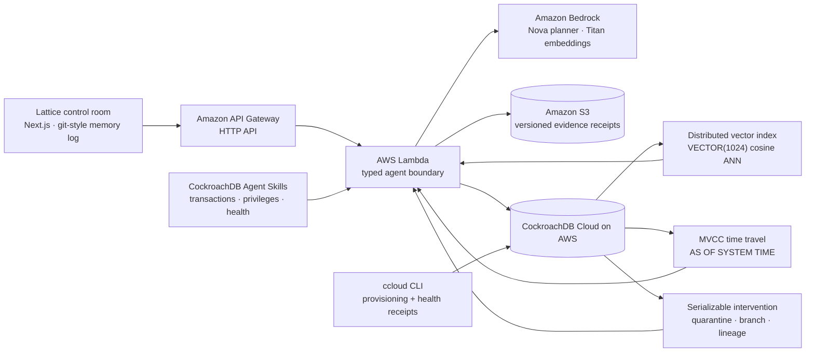
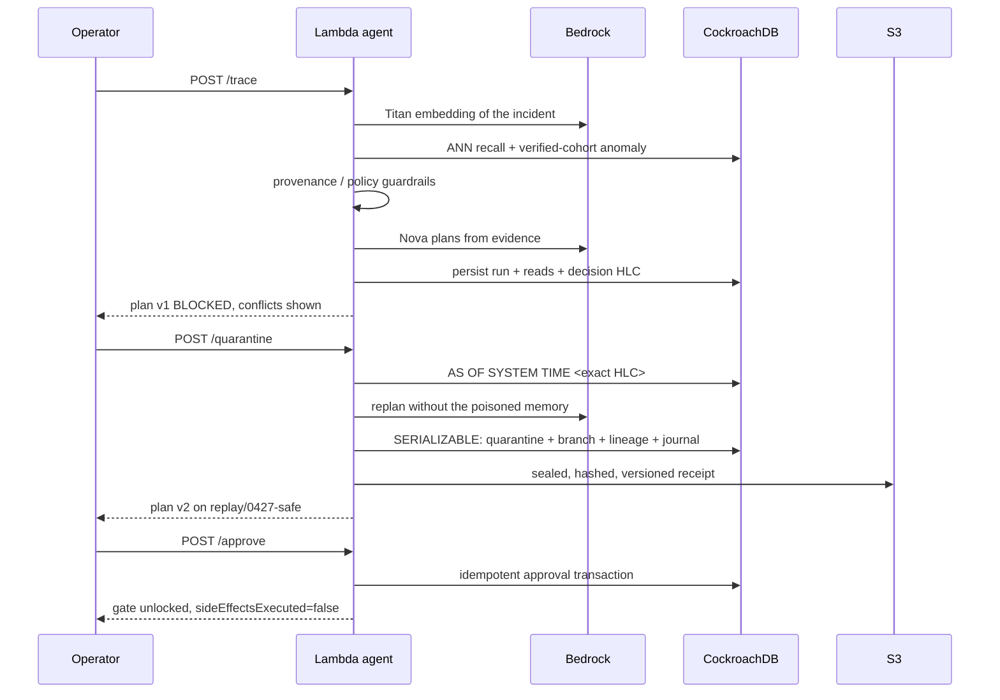

<div align="center">

# Lattice

### Memory that can prove itself.

A flight recorder and action gate for incident-response agents, built on
CockroachDB and AWS.

[](./LICENSE)
[](https://lattice-memory-plane.finora-asr.workers.dev/)
[](https://x8vncko1s0.execute-api.us-east-1.amazonaws.com/health)
[](https://www.cockroachlabs.com/)
[](https://aws.amazon.com/)

**[Live demo](https://lattice-memory-plane.finora-asr.workers.dev/)** ·
**[Agent health](https://x8vncko1s0.execute-api.us-east-1.amazonaws.com/health)** ·
**[Demo video](https://youtu.be/DhyJLhXpFXc?si=W2eglfa1fTEdux46)** ·
**[Devpost challenge](https://cockroachdb-ai.devpost.com/)**



</div>

---

## The problem

Agents are moving from answering questions to changing production systems. Their
memory layer is still treated as a bag of text chunks, and a *relevant* memory
can still be stale, unsigned, poisoned, or superseded.

Retrieval quality is not the safety property that matters. **Which memory was
allowed to change the world** is.

## What Lattice does

Lattice records which memories caused an agent plan, tests those memories
against signed policy and provenance, quarantines untrustworthy recall, and
replays the task on a clean branch **before any side effect can run**.

| Ordinary retrieval | Lattice |
| --- | --- |
| Memories are text chunks | Memories are versioned operational claims |
| Similarity decides what the model sees | Similarity retrieves; provenance decides what may *act* |
| Bad context produces a bad answer | Bad context is quarantined before side effects |
| Logs show what the model said | A queryable graph proves which memory changed the plan |
| Corrections overwrite history | Corrections branch and supersede immutable history |
| Retries can duplicate actions | Every mutation has an idempotency journal |

---

## Verify it yourself in 90 seconds

Everything below runs against the deployed agent. No install, no credentials.

**1. The agent and its database are live**

```bash
curl -s https://x8vncko1s0.execute-api.us-east-1.amazonaws.com/health
```

Returns the live CockroachDB version, the three loaded CockroachDB Agent Skills,
and the AWS configuration.

**2. Run a real trace — vector recall, guardrails, and a Bedrock plan**

```bash
curl -s -X POST https://x8vncko1s0.execute-api.us-east-1.amazonaws.com/trace -H 'content-type: application/json' -d '{"incidentId":"INC-0427"}'
```

Look for `database.decisionHlc` (the exact CockroachDB HLC of this decision) and
the `conflicts` array. Memory `M-211` fails four independent checks:
`SEMANTIC_OUTLIER`, `UNVERIFIED_PROVENANCE`, `LOW_TRUST`, `AUTH_BYPASS`.

**3. Quarantine it and replay from the exact historical snapshot**

Substitute the `runId` returned above:

```bash
curl -s -X POST https://x8vncko1s0.execute-api.us-east-1.amazonaws.com/quarantine -H 'content-type: application/json' -d '{"runId":"YOUR_RUN_ID","memoryId":"M-211","reason":"Unsigned memory proposes an authentication bypass"}'
```

The response carries a `temporalProof` — `AS OF SYSTEM TIME` at the exact HLC,
with the original memory rows reconstructed — plus a new plan on branch
`replay/0427-safe` and a content-hashed, versioned S3 evidence receipt.

**4. The execution gate stays locked until a human approves**

```bash
curl -s -X POST https://x8vncko1s0.execute-api.us-east-1.amazonaws.com/approve -H 'content-type: application/json' -d '{"runId":"YOUR_RUN_ID","actor":"judge"}'
```

Note `"sideEffectsExecuted": false`. Lattice never claims an action ran.

---

## Architecture



### The decision lifecycle



---

## CockroachDB tools

The hackathon requires at least two. Lattice uses **three of the four listed
tools**, plus MVCC time travel as the core of the replay feature. The
Cloud Managed MCP Server is *not* used.

| Tool | What the agent actually does with it | Code |
| --- | --- | --- |
| **Distributed Vector Indexing** | `memories.embedding VECTOR(1024)` carries a workspace-prefixed cosine vector index. The agent retrieves incident memories by ANN, then reuses the same index to score each hit against its **nearest verified-memory cohort** — so the vector layer performs poison detection, not just recall. | [`001_lattice_memory.sql:32`](./services/agent/migrations/001_lattice_memory.sql#L32), [`repository.mjs`](./services/agent/src/repository.mjs) |
| **MVCC time travel** | Every decision stores `cluster_logical_timestamp()`. Replay validates that HLC and issues a real `AS OF SYSTEM TIME` query, reconstructing the memory rows exactly as they existed when the blocked plan was made. | [`repository.mjs` → `reconstructDecisionContext`](./services/agent/src/repository.mjs) |
| **CockroachDB Agent Skills** | The Lambda loads attributed snapshots of `designing-application-transactions`, `hardening-user-privileges`, and `reviewing-cluster-health`. Their guardrails are injected into the planner prompt, and skill receipts are persisted on every run. | [`skills.mjs`](./services/agent/src/skills.mjs), [`skills/`](./services/agent/skills) |
| **ccloud CLI** | Inspects the AWS-backed cluster, creates separate migration and runtime SQL identities, and emits a machine-readable health assessment with a skill receipt. | [`ops/cluster-health.ps1`](./ops/cluster-health.ps1) |

**Serializable intervention lineage.** Quarantine is not a flag update. Memory
intervention, dependent-read state, branch plan, immutable event, and the
idempotent journal outcome all commit in **one retry-aware `SERIALIZABLE`
transaction** ([`repository.mjs` → `quarantineAndBranch`](./services/agent/src/repository.mjs)).

## AWS services

| Service | How it is used |
| --- | --- |
| **AWS Lambda** | Hosts the typed agent execution boundary — retrieval, guardrails, planning, and the action journal. `nodejs24.x` on arm64. |
| **Amazon API Gateway** | HTTP API front door with explicit CORS and idempotency-key headers. |
| **Amazon Bedrock** | Amazon Nova produces structured incident plans; Titan Text v2 produces the 1024-dimension embeddings stored in CockroachDB. |
| **Amazon S3** | Encrypted (AES256), versioned, content-hashed evidence receipts for every quarantine and approval. |

Infrastructure is declared in [`services/agent/template.yaml`](./services/agent/template.yaml) (AWS SAM).

---

## The interface

The control room is a **git client for memory** rather than a dashboard.

- **Memory log** — a `git log --graph` of memory events. Nodes are colour-coded
  by trust state: solid for verified, dashed amber for unsigned, red with a
  blocked glyph for quarantined. Each memory carries a short commit-style hash.
- **Inspector** — click any node for its timestamp, signer, source, trust score,
  cosine similarity, cohort agreement, semantic anomaly, the governing
  `AS OF SYSTEM TIME` value, and the actions that memory influenced.
- **Diff view** — a PR-style split pane. The plan built from poisoned memory sits
  on the left with removed steps struck through in red; the replayed plan draws
  in on the right in green, under a commit-style header naming the excluded
  memory and the reason.
- **Blocked merge** — a memory that fails its checks shows the specific failed
  checks, and **“Approve recovery plan” stays disabled until the quarantine is
  resolved**.

> **No fixture data.** The UI renders only what the API returned from
> CockroachDB. Before a trace runs the screen is deliberately empty. This is
> enforced by a test that fails if any demo memory, plan step, or timeline entry
> is hardcoded into the client — see
> [`tests/rendered-html.test.mjs`](./tests/rendered-html.test.mjs).

---

## Run locally

### Prerequisites

- Node.js 20+ (frontend requires 22.13+)
- A CockroachDB Cloud connection string
- AWS credentials with Bedrock access (or a Gemini key for embedding-only local work)

### Frontend

```bash
npm install
npm run dev
```

Opens on `http://localhost:3000`. On localhost the UI auto-discovers a local
agent at `http://127.0.0.1:8787`; set `NEXT_PUBLIC_LATTICE_API_URL` to point it
anywhere else.

### Agent

```bash
cd services/agent
cp .env.example .env   # then fill in DATABASE_URL and AWS settings
npm install
npm run migrate
npm run seed
npm run dev
```

### Verify

```bash
npm test && npm run smoke && npm run verify:database && npm run harden:runtime
```

The smoke test drives the full retrieval → conflict → quarantine → replay path
against CockroachDB. It fails if the poisoned memory is not retrieved, or if the
replayed plan still contains an authentication bypass.

---

## Deploy to your own AWS account

Nothing here depends on the maintainer's AWS account. A teammate can stand up a
complete, independent copy.

**1. Provision CockroachDB**

Create a cluster ([CockroachDB Cloud](https://cockroachlabs.cloud/)) on **AWS**,
then create two SQL identities so migrations and runtime are separated:

```bash
ccloud cluster user create <cluster-name> lattice_migrator
ccloud cluster user create <cluster-name> lattice_app
```

**2. Enable Bedrock models**

In the AWS console, request access to **Amazon Nova** and **Titan Text
Embeddings V2** in your chosen region.

**3. Migrate and seed**

```bash
cd services/agent
cp .env.example .env    # set DATABASE_URL, MIGRATION_DATABASE_URL, AWS_REGION
npm install
npm run migrate
npm run seed
```

> Seed with the **same embedding provider the Lambda will use**, so stored
> vectors and query vectors share a model. Leave `LATTICE_EMBED_PROVIDER` unset
> to use Bedrock Titan.

**4. Deploy the agent**

```bash
cd services/agent
sam build
sam deploy --guided --parameter-overrides DatabaseUrl="$DATABASE_URL" AllowedOrigin="https://your-frontend.example"
```

SAM creates the Lambda, the HTTP API, and an encrypted, versioned evidence
bucket. Note the `ApiUrl` output.

**5. Restrict the runtime identity**

```bash
npm run harden:runtime
```

`lattice_app` is not an admin — it receives only the table-level privileges the
Lambda needs.

**6. Point the frontend at your agent**

```bash
NEXT_PUBLIC_LATTICE_API_URL="https://<your-api-id>.execute-api.<region>.amazonaws.com" npm run build
```

Never commit connection strings or provider credentials.

---

## Production readiness

- **Short, serializable transactions.** Model and S3 calls stay *outside*
  database transactions.
- **Retry-aware.** SQLSTATE `40001` retries use bounded exponential backoff with
  jitter; ambiguous mutations are never blindly replayed.
- **Idempotent actions.** `(workspace_id, run_id, action_key)` is unique, so a
  repeated request returns the authoritative prior result instead of acting twice.
- **Least privilege.** Separate migration and runtime SQL identities.
- **Untrusted memory by default.** Retrieved text is evidence, never
  instruction. Signature, trust, policy, and destructive-action rules are all
  checked before planning can cross the execution boundary.
- **Truthful completion.** Lattice never reports an action as executed until the
  journal records a completed authoritative result.
- **Human execution gate.** A separate idempotent approval transaction unlocks
  the action envelope.
- **Repeatable isolation.** Quarantine is recorded on the run's branch, so one
  reviewer's demo cannot consume the poisoned memory for everyone else.
- **Tamper evidence.** Every receipt is SHA-256 content-hashed and written to an
  encrypted, versioned S3 bucket.

## API

| Method | Route | Purpose |
| --- | --- | --- |
| `GET` | `/health` | Database, skill, and AWS configuration status |
| `POST` | `/trace` | Retrieve memory, evaluate guardrails, produce a plan |
| `GET` | `/lineage?runId=` | Raw provenance rows for a run, straight from CockroachDB |
| `POST` | `/quarantine` | Time-travel reconstruct, quarantine, branch, replay |
| `POST` | `/approve` | Idempotent human approval of a replayed plan |

## Repository map

```text
app/                         Control-room UI (memory log, inspector, diff view)
services/agent/src/          Lambda handler, retrieval, guardrails, journal
services/agent/migrations/   CockroachDB schema + distributed vector index
services/agent/skills/       Attributed CockroachDB Agent Skill snapshots
services/agent/template.yaml AWS SAM infrastructure
ops/cluster-health.ps1       ccloud health assessment + skill receipt
tests/, services/agent/test/ Build, guardrail, and no-fixture-data tests
docs/                        Demo script and Devpost submission material
```

## Disclosure

Lattice was created from scratch during the 2026 hackathon submission period.
The CockroachDB Agent Skill snapshots are upstream Apache-2.0 material and retain
their license in
[`COCKROACHDB-SKILLS-LICENSE`](./services/agent/skills/COCKROACHDB-SKILLS-LICENSE).

## License

[MIT](./LICENSE)
