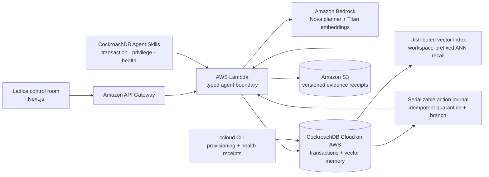

# Lattice

> **Memory that can prove itself.**


Lattice is a flight recorder and action gate for incident-response agents. It
does not merely retrieve old context. It records which memories caused a plan,
tests those memories against signed policy and provenance, quarantines poisoned
or stale recall, and replays the task on a clean branch before any side effect
can run.

Built for the
[CockroachDB × AWS Hackathon — Build with Agentic Memory](https://cockroachdb-ai.devpost.com/).

## The 90-second demo

1. A checkout canary causes a 41% gateway failure rate.
2. Lattice retrieves five semantically similar memories from CockroachDB.
3. One highly similar memory says to disable JWT signature verification.
4. The action gate catches that the memory is unsigned, low-trust, and in
   conflict with a signed production policy. The unsafe plan is blocked.
5. The operator clicks **Quarantine + replay**.
6. CockroachDB atomically quarantines the memory for that run, appends an
   immutable event, creates a trusted branch, and journals the idempotent result.
7. The replay changes the plan from two unsafe actions to zero, then seals a
   tamper-evident evidence receipt in versioned S3.

The key product moment is causal: the interface shows exactly which memory
changed the agent's action and proves that removing it changed the outcome.

## Why this is not “chat with RAG”

| Ordinary retrieval | Lattice |
| --- | --- |
| Memories are text chunks | Memories are versioned operational claims |
| Similarity decides what the model sees | Similarity retrieves; provenance decides what may act |
| Bad context produces a bad answer | Bad context is quarantined before side effects |
| Logs show what the model said | A causal trace shows which memory changed the plan |
| Corrections overwrite history | Corrections branch and supersede immutable history |
| Retries can duplicate actions | Every mutation has an idempotency journal |

## Architecture



### Memory transaction

```text
incident signal
    → Bedrock embedding
    → CockroachDB vector recall
    → provenance + policy guardrails
    → proposed typed plan
    → conflict?
        yes → block → branch-scoped quarantine → replay → S3 receipt
        no  → approval gate → idempotent action journal
```

## Hackathon technology

### CockroachDB tools

- **Distributed Vector Indexing** — `memories.embedding VECTOR(1024)` has a
  workspace-prefixed cosine vector index. Operational and semantic memory stay
  transactionally consistent in the same database.
- **CockroachDB Agent Skills** — the Lambda loads exact, attributed snapshots
  of `designing-application-transactions`, `hardening-user-privileges`, and
  `reviewing-cluster-health`. Every trace persists skill receipts, and the
  planner receives their transaction, retry, least-privilege, and health
  guardrails.
- **ccloud CLI** — used to inspect the AWS-backed cluster, create separate
  migration/runtime identities, and generate a machine-readable health
  assessment through [`ops/cluster-health.ps1`](./ops/cluster-health.ps1).

### AWS services

- **AWS Lambda + API Gateway** host the typed agent execution boundary.
- **Amazon Bedrock** runs the Nova incident planner and Titan 1024-dimensional
  embeddings.
- **Amazon S3** stores encrypted, versioned, content-hashed evidence bundles.
- The CockroachDB Cloud cluster itself runs in **AWS ap-south-1**.

## Reliability and safety

- **Serializable, short transactions.** Remote model and S3 calls stay outside
  database transactions.
- **Retry-aware.** SQLSTATE `40001` retries use bounded exponential backoff and
  jitter; ambiguous mutations are not blindly replayed.
- **Idempotent actions.** `(workspace_id, run_id, action_key)` is unique, so
  repeated quarantine requests return the authoritative prior result.
- **Least privilege.** `lattice_app` is not an admin. It receives only the
  table-level reads/writes needed by the Lambda. Migrations use a separate
  identity.
- **Untrusted memory by default.** Retrieved text is evidence, never
  instruction. Signature, trust, policy, and destructive-action rules are
  checked before planning can cross the execution boundary.
- **Truthful completion.** Lattice never claims an action ran until the
  journal records a completed authoritative result.
- **Repeatable isolation.** Quarantine is recorded on the run's verified branch,
  so one judge cannot consume the poisoned memory for everyone else.
- **Tamper evidence.** Every quarantine receipt includes a SHA-256 content hash
  and is written to an encrypted, versioned S3 bucket.

## Repository map

```text
app/                         Interactive control-room UI
services/agent/src/          Lambda handler, retrieval, guardrails, journal
services/agent/migrations/   CockroachDB schema + distributed vector index
services/agent/skills/       Attributed CockroachDB Agent Skill snapshots
services/agent/template.yaml AWS SAM infrastructure
ops/cluster-health.ps1       ccloud health + skill receipt
docs/                        Demo and Devpost submission material
```

## Run locally

### Prerequisites

- Node.js 20+
- A CockroachDB Cloud connection string
- AWS credentials with Bedrock access, or a Gemini key for local embedding-only
  development

### Frontend

```powershell
npm install
npm run dev
```

The UI opens at `http://localhost:3000`.

### Agent

```powershell
Set-Location services/agent
Copy-Item .env.example .env
npm install
npm run migrate
npm run seed
npm run dev
```

The local Lambda-compatible API listens on `http://127.0.0.1:8787`. On
localhost, the UI discovers it automatically.

### Verify

```powershell
npm test
npm run migrate
npm run seed
npm run smoke
npm run verify:database
npm run harden:runtime
```

The smoke test executes the complete retrieval → conflict → quarantine →
replay path against CockroachDB. It fails if the poisoned memory is not
retrieved or if the replay still contains an authentication bypass.

## Deploy the AWS agent

```powershell
Set-Location services/agent
sam build
sam deploy --guided `
  --parameter-overrides DatabaseUrl="$env:DATABASE_URL" AllowedOrigin="https://your-demo.example"
```

Set the returned API URL as `NEXT_PUBLIC_LATTICE_API_URL` for the frontend.
Never commit connection strings or provider credentials.

## New-project disclosure

Lattice was created from scratch during the 2026 hackathon submission period.
It uses standard open-source frameworks and the Codex Sites starter. The
CockroachDB Agent Skill snapshots are upstream Apache-2.0 material and retain
their license in `services/agent/skills/COCKROACHDB-SKILLS-LICENSE`. No source
code from the builder's earlier projects is incorporated.

## License

MIT — see [`LICENSE`](./LICENSE).
